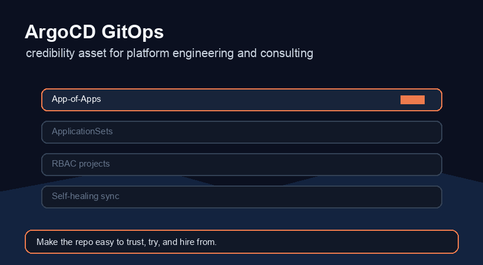

# argocd-gitops




ArgoCD GitOps patterns for multi-cluster Kubernetes. Covers the App-of-Apps bootstrap pattern, ApplicationSets for dynamic application generation, sync policies with automated pruning and self-healing, AppProject RBAC, and environment-specific value overlays.

> All cluster names, namespaces, registry URLs, and hostnames use `PLACEHOLDER_*` values. The patterns and sync configurations reflect production GitOps workflows used to manage 20+ services across staging and prod clusters.

---

## Structure

```
apps/
├── root-app.yaml              App-of-Apps: watches apps/infra/ and apps/services/
├── applicationsets/
│   ├── cluster-addons.yaml    Cluster generator — deploy infra addons to every registered cluster
│   ├── services.yaml          Git directory generator — one Application per service directory
│   └── preview-envs.yaml      Pull request generator — ephemeral preview envs per open PR
├── infra/
│   ├── cert-manager.yaml
│   ├── ingress-nginx.yaml
│   ├── metallb.yaml
│   └── monitoring.yaml
└── services/
    ├── api-gateway.yaml
    ├── user-service.yaml
    └── worker-service.yaml

projects/
├── infra.yaml                 AppProject — cluster-scoped addons, restricted source repos
└── services.yaml              AppProject — application services, namespace-scoped

rbac/
└── policy.csv                 ArgoCD RBAC — read-only for devs, deploy for leads, admin for platform

clusters/
├── prod/
│   └── values.yaml
└── staging/
    └── values.yaml
```

---

## Patterns

### App-of-Apps

A single root Application watches this repo. Any Application manifest added to `apps/infra/` or `apps/services/` is automatically picked up and synced. Bootstrap is one command:

```bash
argocd app create root \
  --repo https://github.com/gerardrecinto/argocd-gitops \
  --path apps \
  --dest-server https://kubernetes.default.svc \
  --dest-namespace argocd \
  --sync-policy automated \
  --auto-prune \
  --self-heal
```

---

### ApplicationSet — Cluster Addons

Deploys cert-manager, ingress-nginx, MetalLB, and monitoring to every cluster registered in ArgoCD. Adding a cluster automatically provisions all addons without any manual Application creation.

See [apps/applicationsets/cluster-addons.yaml](apps/applicationsets/cluster-addons.yaml).

---

### ApplicationSet — Services (Git Directory Generator)

Scans `charts/services/` and creates one Application per subdirectory. New services are deployed by adding a Helm chart directory — no ArgoCD manifest to write.

See [apps/applicationsets/services.yaml](apps/applicationsets/services.yaml).

---

### ApplicationSet — Preview Environments

Uses the pull request generator to create a temporary namespace and Application for every open PR targeting `main`. The preview env is garbage-collected when the PR closes.

See [apps/applicationsets/preview-envs.yaml](apps/applicationsets/preview-envs.yaml).

---

### Sync Policy

All production Applications use:

```yaml
syncPolicy:
  automated:
    prune: true      # removes resources deleted from Git
    selfHeal: true   # reverts manual kubectl edits
  syncOptions:
    - CreateNamespace=true
    - PrunePropagationPolicy=foreground
    - RespectIgnoreDifferences=true
  retry:
    limit: 3
    backoff:
      duration: 10s
      factor: 2
      maxDuration: 3m
```

Staging uses the same policy. Preview envs use manual sync to avoid accidental resource creation.

---

### AppProjects

`projects/infra.yaml` — cluster-admin scope, locked to the platform team's repo, only deploys to `kube-system` and addon namespaces.

`projects/services.yaml` — namespace-scoped, locked to the application services repo, teams can only deploy to their own namespaces.

See [projects/](projects/).

---

### RBAC

```csv
# rbac/policy.csv
p, role:readonly,    applications, get,    */*, allow
p, role:readonly,    applications, list,   */*, allow
p, role:developer,   applications, sync,   services/*, allow
p, role:developer,   applications, get,    services/*, allow
p, role:lead,        applications, *,      services/*, allow
p, role:platform,    *,            *,      */*, allow

g, PLACEHOLDER_DEV_GROUP,      role:developer
g, PLACEHOLDER_LEAD_GROUP,     role:lead
g, PLACEHOLDER_PLATFORM_GROUP, role:platform
```
