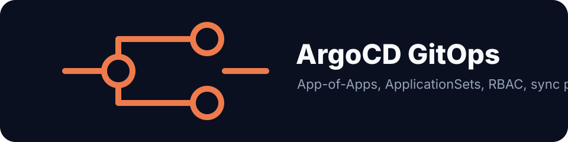
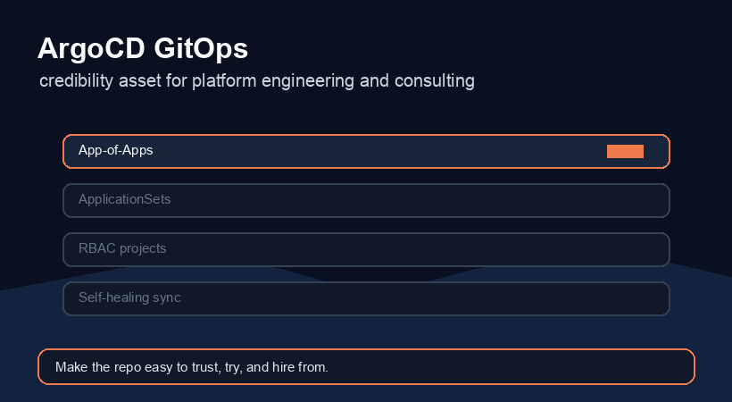

# argocd-gitops






ArgoCD GitOps patterns for multi-cluster Kubernetes. Covers the App-of-Apps bootstrap pattern, ApplicationSets for dynamic application generation, sync policies with automated pruning and self-healing, AppProject RBAC, and environment-specific value overlays.

Commercial angle and consulting hooks: [docs/go-to-market.md](docs/go-to-market.md).

> All cluster names, namespaces, registry URLs, and hostnames use `PLACEHOLDER_*` values. These are reference patterns, not a live cluster's actual config. Swap the placeholders for your own before applying anything here.

---

## Structure

```
apps/
├── root-app.yaml              App-of-Apps: watches apps/infra/ and apps/services/
├── applicationsets/
│   ├── cluster-addons.yaml    Cluster generator: deploy infra addons to every registered cluster
│   ├── services.yaml          Git directory generator: one Application per service directory
│   └── preview-envs.yaml      Pull request generator: ephemeral preview envs per open PR
├── infra/
│   ├── cert-manager.yaml
│   ├── ingress-nginx.yaml
│   ├── metallb.yaml
│   └── monitoring.yaml
└── services/
    └── api-gateway.yaml        Standalone Application, onboarded before the ApplicationSet existed

projects/
├── infra.yaml                 AppProject: cluster-scoped addons, restricted source repos
└── services.yaml              AppProject: application services, namespace-scoped

rbac/
└── policy.csv                 ArgoCD RBAC: get/list for everyone, sync for devs on services/*, full control for leads on services/*, admin for platform

clusters/
├── prod/
│   └── values.yaml         Per-cluster overrides (domain, ingress IP, replica bounds), reference
└── staging/                 values for teams wiring their own service charts, not consumed by
    └── values.yaml          any Application in this repo yet.
```

---

## Patterns

### App-of-Apps

A single root Application watches this repo. Any Application manifest added to `apps/infra/` or `apps/services/` is automatically picked up and synced. Bootstrap is one command:

```bash
argocd app create root \
  --repo https://github.com/gerardrecinto/argocd-gitops \
  --path apps \
  --dest-server https://kubernetes.default.svc \
  --dest-namespace argocd \
  --sync-policy automated \
  --auto-prune \
  --self-heal
```

---

### ApplicationSet: Cluster Addons

Deploys cert-manager, ingress-nginx, MetalLB, and monitoring to every cluster registered in ArgoCD. Adding a cluster automatically provisions all addons without any manual Application creation.

See [apps/applicationsets/cluster-addons.yaml](apps/applicationsets/cluster-addons.yaml).

`apps/infra/monitoring.yaml` points Grafana's admin credentials at a `grafana-admin-credentials` secret (`admin.existingSecret`) instead of a plaintext value. That secret is provisioned per-cluster out of band, through the platform team's secrets manager, and never committed to this repo. It needs to exist before the monitoring Application syncs.

---

### ApplicationSet: Services (Git Directory Generator)

Scans `charts/services/` and creates one Application per subdirectory. New services are deployed by adding a Helm chart directory: no ArgoCD manifest to write. `charts/services/` doesn't exist yet in this repo; `apps/services/api-gateway.yaml` predates the ApplicationSet and is still managed as a standalone Application.

See [apps/applicationsets/services.yaml](apps/applicationsets/services.yaml).

---

### ApplicationSet: Preview Environments

Uses the pull request generator to create a temporary namespace and Application for every open PR targeting `main`. The preview env is garbage-collected when the PR closes.

See [apps/applicationsets/preview-envs.yaml](apps/applicationsets/preview-envs.yaml).

---

### Sync Policy

All production Applications use:

```yaml
syncPolicy:
  automated:
    prune: true      # removes resources deleted from Git
    selfHeal: true   # reverts manual kubectl edits
  syncOptions:
    - CreateNamespace=true
    - PrunePropagationPolicy=foreground
    - RespectIgnoreDifferences=true
  retry:
    limit: 3
    backoff:
      duration: 10s
      factor: 2
      maxDuration: 3m
```

Staging uses the same policy. Preview envs use manual sync to avoid accidental resource creation.

---

### AppProjects

`projects/infra.yaml`: cluster-admin scope, locked to the platform team's repo, only deploys to `kube-system` and addon namespaces.

`projects/services.yaml`: namespace-scoped, locked to the application services repo, teams can only deploy to their own namespaces.

See [projects/](projects/).

---

### RBAC

Four roles, scoped by both action and project so no role gets a blanket `*/*` grant except `platform`, which is the intentional break-glass/admin tier:

- `readonly`: every authenticated user, `get`/`list` on applications across all projects, `get` on repositories. No write actions anywhere.
- `developer`: `get`/`sync`/`action` on `services/*` only. Cannot touch `infra/*`.
- `lead`: full application actions on `services/*` only, plus `repositories, get`. Still can't touch `infra/*`.
- `platform`: unrestricted. The platform team owns cluster-scoped infra and needs it.

See [rbac/policy.csv](rbac/policy.csv) for the exact policy: it's the source of truth, this section just summarizes the intent.

---

### Local Validation

`.github/workflows/ci.yml` runs yamllint and kubeconform against `apps/` and `projects/` on every push. Run the same checks locally before pushing:

```bash
./scripts/validate.sh
```

Requires `yamllint` (`pip install yamllint`) and `kubeconform` on PATH.
